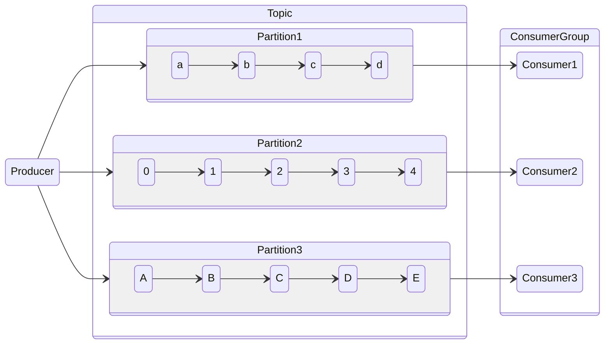
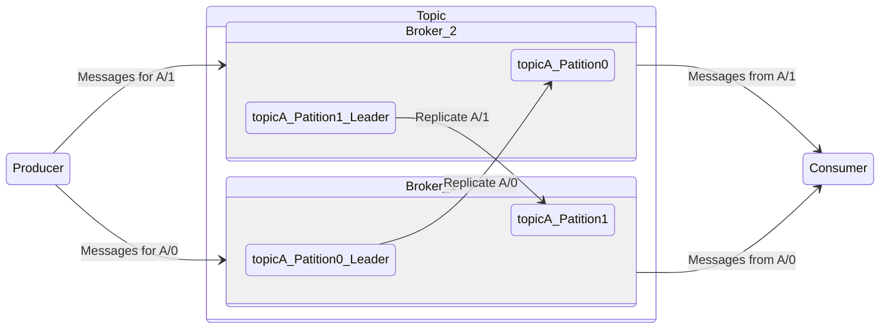

## History
Kafka was developed as a *publishing/subscribe* messaging system. It is described as **distributed commit log** and **
distributing streaming platform**.
Commit log is designed to provide a durable record of all transactions so that they can be replayed to consistently
build the state of a system.

> Data within Kafka is stored durably

## Terminology

- **Message** - The unit of data within kafka. It is simply an array of bytes. It can be thought of as a row in a
  database table. A message can have optional metadata referred to as key.
- **Key** - Key is a byte array as with the message, has no specific meaning to kafka. *Keys are used when messages are
  to be written to partition in a more controlled manner*. The simplest is to generate a consistent has of the key and
  then select the partition number for that message by taking the result of the had modulo the total number of
  partitions in the topic. This ensures that messages with the same key are always written to the same partition.*
- **batch** - Kafka writes messages in batches for efficiency. *A batch is a collection of messages*, that are produced
  to the same topic and partition.
- **Schema** - Consistent data format decouples writing and reading messages. When these are tightly coupled,
  applications that subscribe to message must be updated to handle the new data format. *By using well-defined schemas
  and storing them in a common repository, the messages in Kafka can be understood without coordination*

## Topics and Partitions ##

- **Topic** - Message are categorized into topics. A topic can be thought of as a database table.
- **Partition** - Topics are broken down into a number of partitions. Message are written to it an append-only fashion
  and are read in order from beginning to end. *A topic typically has multiple partitions, there is no guarantee of
  message ordering across the topic.*
- **Producer** - Creates new messages. A message can be produced to a specific topic. By default, provider will balance messages over all partitions. This is done using message key and a partitioner that will generate a hash of the key and map it to a specific partition. This ensures that messages produced with a given key will get written to the same partition.
- **Consumer** - Read messages. A consumer can subscribe to one or more topics and reads the messages in the order in which they were produced to each partition. The consumer keeps track of which messages it has already consumed by keeping track of the offset of messages.
> The offset - an integer value that continually increase - is another piece of metadata that kafka adds to each message as it is producer.

## Brokers and Clusters
- **Broker** - A single Kafka server is called a broker. A broker received messages from producers, assigns offsets to them, and writes the messages to storage on disk. It also services consumers, responding to fetch requests for partitions and responding with the messages that have been published. A single broker can easily handle thousands of partitions and millions of messages per seconds.
- **Cluster** - Kafka brokers are designed to operate as a part of cluster. 
- **Leader** - *Within a cluster of brokers, **one broker will also function as the cluster controller**(elected automatically from the live members of the cluster)*. The controller is responsible for administrative operations, including assigning partitions to broker and monitoring for broker failures. A partition is owned by a single broker in the cluster, and that broker is called the **leader** of the partition.
- **Follower** - A replicated partition is assigned to an additional brokers called followers of the partition. Replication provides redundancy of the messages in the partition, such that one of the followers can take over leadership if there is a broker failure.

> All producers must connect to the leader in order to publish messages, but consumers may fetch from wither the leader of one of the followers.

## Data Retention
Kafka retains messages for some period of time (e.g., 7 days) or until the partition reaches a certain size in bytes (e.g., 100MB). Once these limits are reached, messages are expired and deleted.
